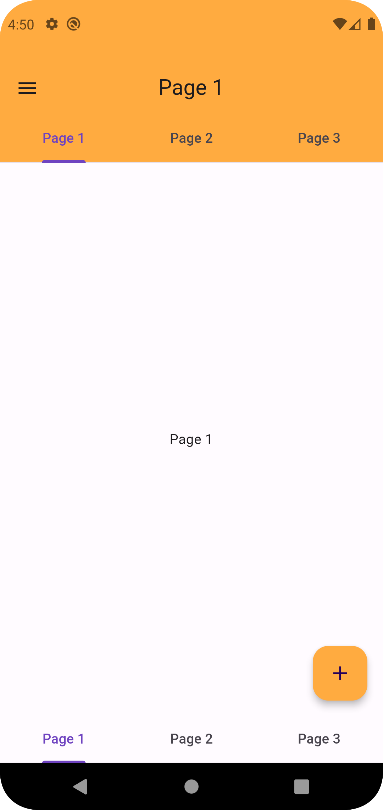
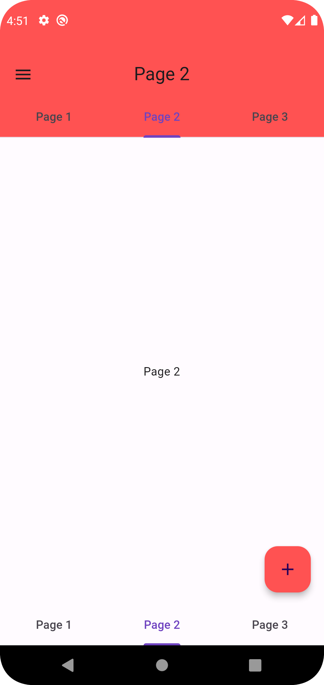
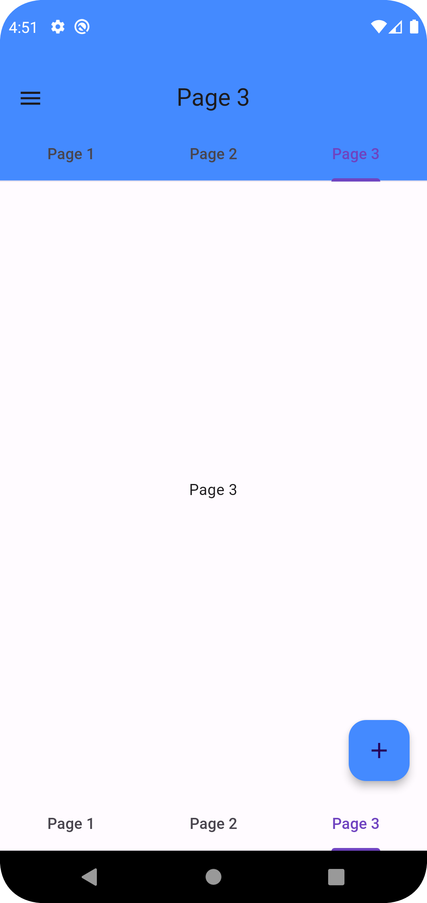
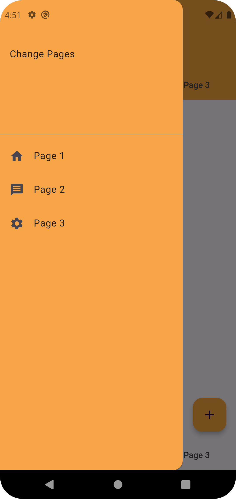
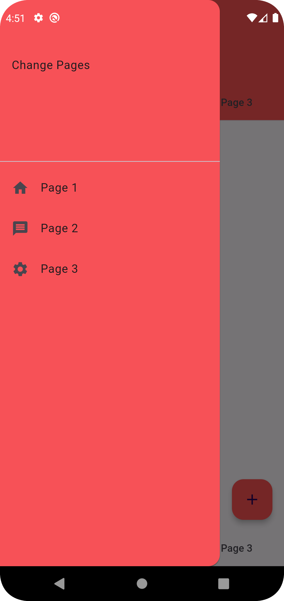

# Ostad_Flutter_Assignments_1
Flutter Beginning
Create a Flutter app with three pages arranged in a tab view screen. Each page will
have a different coloured floating action button and a centred text widget displaying
the page number.
Requirements:
● Use MaterialApp and Scaffold widgets.
● Include an AppBar with a navigation drawer and a bottom navigation tab bar.
● The navigation drawer should allow users to navigate to each page.
● The bottom navigation tab bar should enable users to switch between the
pages.
● Each page should have a unique coloured floating action button.
● Centre a text widget on each page displaying the page number.
● Ensure navigation from the drawer and tab bar leads to the correct pages.
● Use TabBarView and TabBar widgets for tabbed navigation.

        

        
