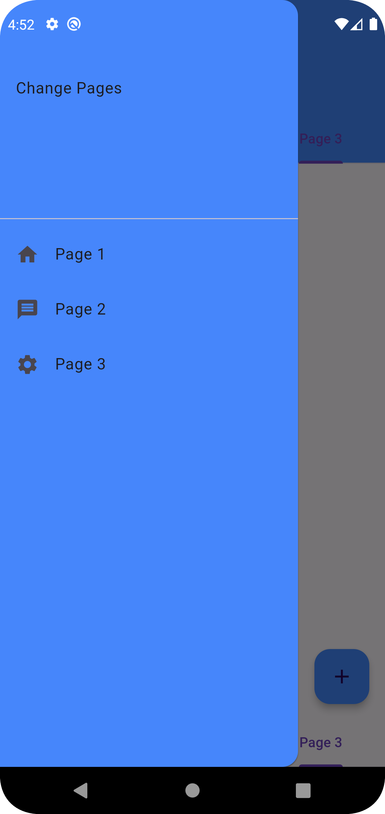

# Ostad_Flutter_Assignments_1
#Flutter Beginning

Create a Flutter app with three pages arranged in a tab view screen. Each page will
have a different coloured floating action button and a centred text widget displaying
the page number.
Requirements:
<li> Use MaterialApp and Scaffold widgets. </li>
<li> Include an AppBar with a navigation drawer and a bottom navigation tab bar. </li>
<li> The navigation drawer should allow users to navigate to each page. </li>
<li> The bottom navigation tab bar should enable users to switch between the pages. </li>
<li> Each page should have a unique coloured floating action button. </li>
<li> Centre a text widget on each page displaying the page number. </li>
<li> Ensure navigation from the drawer and tab bar leads to the correct pages. </li>
<li> Use TabBarView and TabBar widgets for tabbed navigation. </li>

        

        
